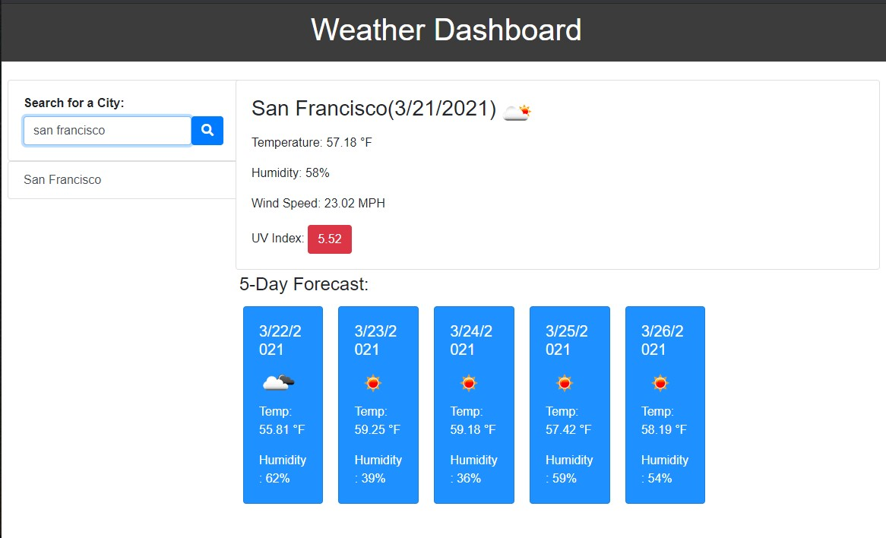

# Weather Dashboard

## Table of contents

- [General info](#general-info)
- [Technologies](#technologies)
- [Screenshot](#screenshot)
- [Credits](#credits)

## General info

This project is a weather dashboard app with search functionality to find current weather conditions and forecasted weather for multiple cities. It uses the OpenWeather API to retrieve data for the cities, AJAX to hook into the API to retrieve the data in JSON format, dynamically updated HTML, and CSS powered by jQuery.

## Technologies

This project is created with:

- Bootstrap 4
- CSS
- Font Awesome
- HTML:5
- JavaScript
- jQuery
- Moment.js
- Open Weather API

## Screenshot

Link to my deployed github page: https://vpickard707.github.io/weather-dash/

# Credits

I consulted the OpenWeather API documentation (https://openweathermap.org/api), a tutorial for the Open Weather API (http://osp123.github.io/tutorials/html/weatherAPI.html), Moment.js (https://momentjs.com/), jQuery API Documentation (https://api.jquery.com/), W3Schools (https://www.w3schools.com/js/default.asp), MDN Web Docs (https://developer.mozilla.org/en-US/docs/Web/JavaScript), and Bootstrap 4 (https://getbootstrap.com/) extensively in creating my project. Some other resources that I used include: Stack Overflow (#https://stackoverflow.com/) and the GitLab repository for my course, specifically referencing the in-class activities.
